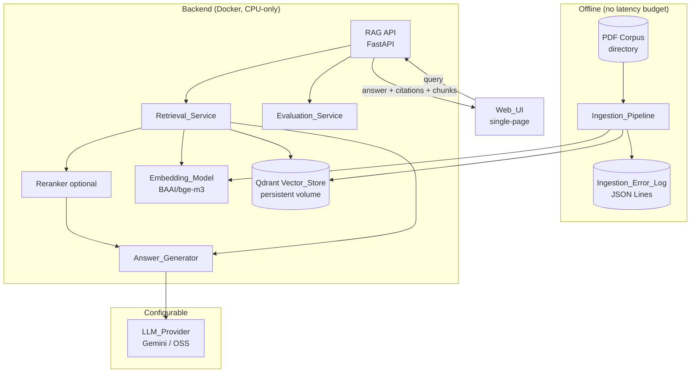
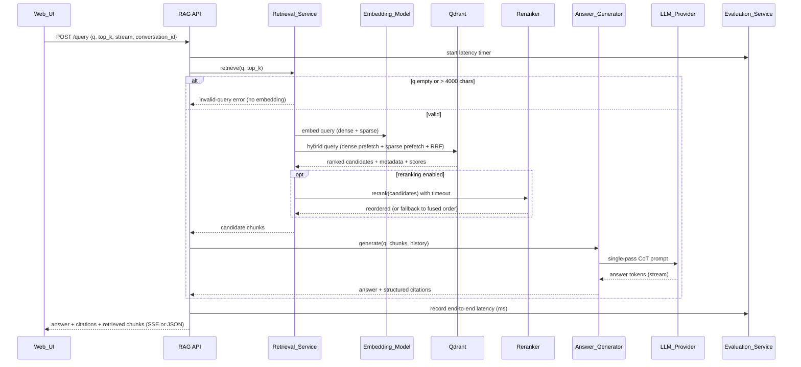

# Design Document

## Overview

The RAG PDF Chatbot is an offline-ingested, persistent-corpus question-answering system that answers natural-language questions over a large private corpus of PDF documents (at least 10 PDFs, each 200+ pages) and returns answers with page-level provenance. It evolves the existing ephemeral, per-session DocQA backend (FastAPI + Gemini + in-memory FAISS) into a durable, hybrid-retrieval system backed by Qdrant, and replaces the multi-page React frontend with a single-page chat UI.

The design is organized around two distinct execution paths with very different performance budgets:

1. **Offline Ingestion Path** (not latency-bound): walk a directory of PDFs → extract native text (PyMuPDF) with targeted OCR (Tesseract) → clean/normalize/language-tag → deterministically chunk with page metadata → embed with `BAAI/bge-m3` (dense + sparse in one pass) → upsert into Qdrant with idempotency → emit a structured JSON-Lines error log.
2. **Interactive Query Path** (5 s end-to-end budget, 2 s first-token when streaming): receive query → validate → embed query (dense + sparse) → hybrid search in Qdrant fused with Reciprocal Rank Fusion → optional rerank → single-pass Chain-of-Thought answer generation with citations via a configurable LLM provider → return answer + structured citations + retrieved chunks to the Web UI.

A cross-cutting **Evaluation_Service** records per-query latency and computes retrieval/answer-quality metrics (p95 latency, R@k, MRR, citation accuracy, hallucination rate). The whole system is CPU-only and Docker-deployable; only the LLM provider may be a hosted service (Gemini).

### Key design decisions and rationale

| Decision | Rationale |
| --- | --- |
| **Qdrant** as vector store (replaces in-memory FAISS) | Native support for *named vectors* (dense + sparse in one point), built-in HNSW ANN index, server-side RRF fusion via the Query API, and on-disk persistence that survives restarts — directly satisfies Requirements 4, 5, 6. |
| **`BAAI/bge-m3`** embedding model (replaces `paraphrase-multilingual-mpnet-base-v2`) | Emits dense **and** sparse (lexical) vectors in a single forward pass, supports 8192 tokens and 100+ languages, all on CPU — satisfies Requirements 4.1, 4.2 and enables hybrid search without a separate BM25 stage. |
| **PyMuPDF + conditional Tesseract OCR** | PyMuPDF is fast for native text; OCR is expensive, so it runs only on zero-character pages and on embedded-image bounding boxes — keeps ingestion tractable while recovering scanned/visual content (Requirement 1). Zero-VRAM, open-source. |
| **Semantic Markdown Wrapping** instead of a vision-language model | Wraps OCR'd image text in a `> [System Note: Image Content] ...` marker appended to the page text, so a text-only LLM can reference diagrams without any GPU/VLM (Requirements 1.3–1.4, 8.3). |
| **Deterministic recursive chunking** with a single fixed tokenizer | Reproducible chunk boundaries and metadata are required for idempotent re-ingestion and reproducible citations (Requirements 3, 5.4). |
| **Reciprocal Rank Fusion (RRF)** for hybrid fusion | Rank-based fusion is scale-free (no need to normalize incomparable dense L2 vs sparse BM25 scores) and is natively supported by Qdrant's Query API (Requirement 6.3). |
| **Single-pass Chain-of-Thought** generation, no agentic routing | Meets the latency budget and the explicit "no multi-step/map-reduce" constraint (Requirements 8.1, 8.2). |
| **Configurable LLM provider** abstraction | Keeps Gemini as the default hosted provider while leaving the rest of the stack CPU-only and open-source (Requirements 8.6, 14.4). |
| **Streaming SSE** retained from existing backend | Enables the 2 s first-token budget (Requirement 9.4) while reusing the proven `text/event-stream` pattern already in `app.py`. |

### Research notes informing the design

- **Qdrant hybrid search**: Qdrant's Query API accepts multiple `prefetch` branches (one dense, one sparse) and a `fusion: rrf` step that merges them server-side into one ranked list, avoiding a client-side fusion round trip. Sparse vectors are stored as `{indices: [...], values: [...]}`. ([Qdrant hybrid queries documentation](https://qdrant.tech/documentation/concepts/hybrid-queries/)) Content was rephrased for compliance with licensing restrictions.
- **BGE-M3 multi-functionality**: The model produces dense, sparse (lexical weights), and multi-vector representations from one encoder pass; the FlagEmbedding library exposes `return_dense` and `return_sparse` flags. ([BAAI/bge-m3 model card](https://huggingface.co/BAAI/bge-m3)) Content was rephrased for compliance with licensing restrictions.
- **PyMuPDF + OCR**: PyMuPDF (`fitz`) exposes per-page `get_text()`, per-page image extraction with bounding boxes (`page.get_images` / `page.get_image_rects`), and page rasterization (`page.get_pixmap`) suitable for piping into Tesseract via `pytesseract`. ([PyMuPDF documentation](https://pymupdf.readthedocs.io/)) Content was rephrased for compliance with licensing restrictions.
- **RRF formula**: each item's fused score is the sum over result lists of `1 / (k + rank)`, with `k` a smoothing constant (commonly 60); items are then sorted by descending fused score. This is the standard rank-fusion definition used to combine heterogeneous rankers.

## Architecture

### System context



### Ingestion pipeline flow

```mermaid
flowchart LR
    A[PDF file] --> B{Open with PyMuPDF}
    B -->|fail: corrupt/encrypted| ERR[Record ingestion error<br/>skip doc, continue]
    B -->|ok| C[For each page]
    C --> D[Extract native text]
    D --> E{Zero native chars?}
    E -->|yes| F[OCR full-page render]
    E -->|no| G[Extract embedded image boxes]
    G --> H[OCR each image box]
    H --> I[Wrap in Semantic Markdown<br/>append to page text]
    F --> J[Page text]
    I --> J
    J --> K[Normalize whitespace + strip control chars]
    K --> L[Remove repeated header/footer lines]
    L --> M[Detect language ISO-639-1 or und]
    M --> N[Recursive chunk<br/>max 800 tokens, ~150 overlap<br/>min final 100 tokens]
    N --> O[Attach Chunk_Metadata]
    O --> P{Chunk exists<br/>identical text+metadata?}
    P -->|yes| Q[Reuse vectors, skip embed]
    P -->|no| R[Embed dense+sparse bge-m3]
    R --> S[Upsert to Qdrant]
    Q --> S
    S -->|fail| ERR
```



### Interactive query flow



### Component responsibilities

- **Ingestion_Pipeline** (`backend/ingestion/`): orchestrates extraction → cleaning → chunking → embedding → persistence; owns the `Ingestion_Error_Log`. Pure-logic subcomponents (cleaning, chunking, RRF, citation building) are isolated from I/O so they are unit- and property-testable.
- **Text_Extractor / OCR_Engine** (`backend/ingestion/extract.py`): PyMuPDF native extraction + conditional Tesseract OCR with Semantic Markdown Wrapping.
- **Cleaner** (`backend/ingestion/clean.py`): whitespace normalization, control-character stripping, repeated-line (header/footer) removal.
- **Language_Detector** (`backend/ingestion/language.py`): ISO 639-1 detection with confidence threshold, `und` fallback.
- **Chunker** (`backend/ingestion/chunker.py`): deterministic recursive token-bounded splitting with overlap and metadata (replaces `utils/splitter.py`).
- **Embedding_Model wrapper** (`backend/embedding.py`): loads `BAAI/bge-m3` once, returns dense + sparse vectors.
- **Vector_Store adapter** (`backend/vector_store.py`): Qdrant client wrapper — collection setup (named dense + sparse vectors, HNSW), idempotent upsert, hybrid query, persistence.
- **Retrieval_Service** (`backend/retrieval.py`): query validation, query embedding, hybrid search, RRF (delegated to Qdrant), result assembly.
- **Reranker** (`backend/reranker.py`): optional cross-encoder/lexical reordering with timeout fallback.
- **Answer_Generator** (`backend/generation.py`): CoT prompt assembly, provider routing, citation extraction/aggregation, language matching.
- **LLM_Provider abstraction** (`backend/providers/`): `LLMProvider` interface + `GeminiProvider` (default) + room for OSS providers.
- **Conversation_Session store** (`backend/conversation.py`): per-session ordered turn history with 10-turn / 4000-token bounds.
- **Evaluation_Service** (`backend/evaluation.py`): latency ring buffer + metric computation (p95, R@k, MRR, citation accuracy, hallucination rate).
- **Web_UI** (`frontend/`): single-page chat with citation display, retrieved-chunk visualization, pipeline-stage display, pending/error states.

## Components and Interfaces

### Chunker

```python
@dataclass(frozen=True)
class ChunkerConfig:
    max_tokens: int = 800          # CHUNK_MAX_TOKENS
    overlap_tokens: int = 150      # CHUNK_OVERLAP_TOKENS (10%..30% of max_tokens)
    min_final_tokens: int = 100    # CHUNK_MIN_FINAL_TOKENS (1..max_tokens)

class Chunker:
    """Deterministic, recursive, token-bounded splitter with overlap and metadata."""
    def __init__(self, config: ChunkerConfig, tokenizer: "Tokenizer"):
        """Validates config on construction. Raises ChunkerConfigError when
        max_tokens/overlap are out of range or min_final_tokens is not in
        1..max_tokens, producing no chunks (Req 3.10)."""

    def chunk(self, pages: list["PageText"]) -> list[Chunk]:
        """Split normalized, page-tagged text into <= max_tokens passages with
        ~overlap_tokens overlap, attaching Chunk_Metadata to each chunk.
        Final-remainder disposition (Req 3.6-3.8) is handled by _emit_final."""
```

Final-remainder algorithm (Req 3.6, 3.7, 3.8). After the recursive splitter has emitted as many maximally-sized chunks as possible, a trailing remainder `R` (the tokens left over that did not fill a full chunk) is disposed of as follows:

```text
emit_final(chunks, remainder, meta):
    r = token_count(remainder)
    if r == 0:
        return chunks                              # nothing left over
    if r >= config.min_final_tokens:
        # Req 3.6: large-enough remainder becomes its own final chunk
        chunks.append(Chunk(text=remainder, metadata=meta))
    elif chunks:                                   # r < min_final_tokens
        # Req 3.7: too-small remainder merges into the immediately preceding
        # chunk, retaining that preceding chunk's Chunk_Metadata (NOT meta).
        prev = chunks[-1]
        merged_text = join_without_double_overlap(prev.text, remainder)
        chunks[-1] = Chunk(text=merged_text, metadata=prev.metadata)
    else:
        # Req 3.8: no prior chunk exists -> standalone final chunk
        chunks.append(Chunk(text=remainder, metadata=meta))
    return chunks
```

Note: merging a sub-minimum remainder into the preceding chunk (Req 3.7) can make that single final chunk exceed `max_tokens` by fewer than `min_final_tokens` tokens. This is the only case in which a chunk may exceed `max_tokens` (see Property 5).

### Embedding_Model wrapper

```python
class EmbeddingModel:
    """Wraps BAAI/bge-m3; returns dense and sparse vectors in one pass."""
    def __init__(self, model_name: str = "BAAI/bge-m3"): ...

    def embed(self, texts: list[str]) -> list["EmbeddingResult"]:
        """One forward pass yields both representations per text."""

@dataclass(frozen=True)
class SparseVector:
    indices: list[int]   # term ids
    values: list[float]  # term weights

@dataclass(frozen=True)
class EmbeddingResult:
    dense: list[float]          # length = model dim (1024 for bge-m3)
    sparse: SparseVector
```

### Vector_Store adapter (Qdrant)

```python
class VectorStore:
    def ensure_collection(self) -> None:
        """Create collection with named 'dense' (HNSW) and 'sparse' vectors if absent."""

    def upsert_chunk(self, chunk: "Chunk", emb: EmbeddingResult) -> None:
        """Idempotent: point id is a deterministic hash of (text + metadata).
        Reuses existing point when id already present."""

    def exists(self, point_id: str) -> bool: ...

    def hybrid_search(self, dense: list[float], sparse: SparseVector,
                      top_k: int, scope: "Scope | None" = None) -> list["Candidate"]:
        """Single Query API call: dense prefetch + sparse prefetch fused via RRF."""

    def count(self) -> int: ...
```

The Qdrant point id is `sha256(normalized_text + "\u0000" + pdf_id + "\u0000" + str(page_number) + "\u0000" + str(chunk_position))`, giving idempotent upserts (Requirements 4.4, 5.4).

### Retrieval_Service

```python
class RetrievalService:
    MAX_QUERY_CHARS = 4000
    DEFAULT_TOP_K = 5

    def retrieve(self, query: str, top_k: int = DEFAULT_TOP_K) -> "RetrievalResult":
        """Validates query (1..4000 chars, top_k 1..100), embeds, hybrid-searches.
        Raises InvalidQueryError before embedding when query is empty or too long."""
```

### Reranker

```python
class Reranker:
    def rerank(self, query: str, candidates: list["Candidate"],
               timeout_s: float) -> list["Candidate"]:
        """Stable reorder by descending relevance; ties keep original fused rank.
        On error/timeout, caller falls back to the input order."""
```

### Answer_Generator and LLM provider

```python
class LLMProvider(Protocol):
    name: str
    async def generate(self, prompt: str, *, timeout_s: float,
                       stream: bool) -> AsyncIterator[str]: ...

class GeminiProvider(LLMProvider): ...   # default hosted provider

class AnswerGenerator:
    def build_prompt(self, query: str, chunks: list["Candidate"],
                     history: list["Turn"], answer_language: str) -> str: ...

    def build_citations(self, chunks: list["Candidate"]) -> list["Citation"]:
        """One Citation per distinct filename; pages = sorted unique page numbers."""

    async def generate(self, query: str, chunks: list["Candidate"],
                       history: list["Turn"]) -> "GenerationResult":
        """Empty chunks -> 'no relevant information' + zero citations.
        Provider error/timeout -> error result, zero citations, no partial answer."""
```

### Conversation_Session store

```python
class ConversationStore:
    MAX_TURNS = 10
    MAX_TOKENS = 4000

    def append(self, session_id: str, turn: "Turn") -> None:
        """Append the turn. When the session already holds prior turns, evict the
        oldest turns until both the 10-turn and 4000-token bounds hold. When the
        session is empty before this append (no prior turns), skip the
        history-cleanup/eviction pass entirely as a fast path (Req 12.5)."""
    def history(self, session_id: str) -> list["Turn"]: ...
    def clear(self, session_id: str) -> None: ...
```

### Evaluation_Service

```python
class EvaluationService:
    MIN_LATENCY_SAMPLES = 30
    MIN_EVAL_QUERIES = 10

    def record_latency_ms(self, ms: float) -> None: ...
    def p95_latency_s(self) -> "MetricResult":          # insufficient if < 30 samples
    def recall_at_k_and_mrr(self, eval_set) -> "MetricResult": ...
    def citation_accuracy(self, eval_set) -> "MetricResult": ...
    def hallucination_rate(self, eval_set) -> "MetricResult": ...
    def report(self) -> "MetricsReport":                # latest values + sample sizes
```

### HTTP API (FastAPI)

| Method & path | Purpose | Maps to |
| --- | --- | --- |
| `POST /conversations` | Start a new Conversation_Session, returns `conversation_id` | 12.1, 12.6 |
| `POST /conversations/{id}/query` | Submit a query (body: `q`, `top_k?`, `stream?`); returns answer + citations + retrieved chunks, or SSE stream | 6, 8, 9, 11, 12 |
| `DELETE /conversations/{id}` | Clear conversation history | 12.6 |
| `GET /metrics` | Latest evaluation metrics with sample sizes | 10.7 |
| `GET /healthz` | Liveness + Qdrant reachability + corpus count | 14.5 |

### Web_UI structure

A single Vite/React page (`frontend/src/App.jsx`) composed of:
- `ChatPanel` — query input + answer display, no full-page reload (11.1), pending indicator (11.7), error state preserving input text (11.8).
- `CitationList` — per-citation filename + all page numbers (11.2); "no sources" indication when empty (11.3).
- `RetrievedChunks` — each Top_K chunk with score, filename, page (11.4); "no passages" indication when empty (11.5).
- `PipelineStages` — static ordered display: PDF → chunking → embedding → Vector_Store (11.6).
- Streaming consumed via the existing SSE pattern in `frontend/src/services/api.js`, extended with a `sources`/`chunks` event and an `end`/`error` event.

## Data Models

```python
@dataclass(frozen=True)
class ChunkMetadata:
    pdf_id: str            # stable id derived from file path/content
    filename: str
    page_number: int       # 1-based; page of first token when chunk spans pages
    chunk_position: int    # 0-based ordinal within the PDF
    language: str          # ISO 639-1 (e.g. "en") or "und"

@dataclass(frozen=True)
class Chunk:
    text: str
    metadata: ChunkMetadata

@dataclass(frozen=True)
class Candidate:
    text: str
    score: float           # fused RRF score (or rerank score when reranked)
    metadata: ChunkMetadata

@dataclass(frozen=True)
class Citation:
    filename: str
    pages: list[int]       # sorted, unique

@dataclass(frozen=True)
class Turn:
    question: str
    answer: str

@dataclass
class GenerationResult:
    answer: str
    citations: list[Citation]
    error: str | None = None

@dataclass
class IngestionErrorEntry:
    filename: str
    page_number: int | None
    stage: str             # "extraction" | "ocr" | "embedding" | "persistence"
    reason: str
    timestamp: str         # ISO 8601
```

### Qdrant collection schema

```text
collection: "corpus"
  vectors:
    dense:  { size: 1024, distance: Cosine, hnsw_config: { m: 16, ef_construct: 128 } }
  sparse_vectors:
    sparse: { }                       # bge-m3 lexical weights
  payload:
    text: str
    pdf_id: str, filename: str, page_number: int, chunk_position: int, language: str
  point id: sha256(text + metadata)   # idempotency key
```

### Ingestion_Error_Log format

JSON Lines (`.jsonl`) on a durable path; one self-contained object per failure, e.g.:

```json
{"timestamp":"2025-01-01T12:00:00Z","filename":"report.pdf","page_number":42,"stage":"ocr","reason":"tesseract returned no text"}
```

### Configuration

```text
LLM_PROVIDER=gemini            GENERATION_TIMEOUT_S=30   (range 1..120)
EMBEDDING_MODEL=BAAI/bge-m3    CHUNK_MAX_TOKENS=800
CHUNK_OVERLAP_TOKENS=150       (must be 10%..30% of CHUNK_MAX_TOKENS)
CHUNK_MIN_FINAL_TOKENS=100     (range 1..CHUNK_MAX_TOKENS; final remainder smaller than this merges into the preceding chunk)
DEFAULT_TOP_K=5                (range 1..100)
RERANK_ENABLED=false           RERANK_TIMEOUT_S=2
QDRANT_URL=http://qdrant:6333  QDRANT_COLLECTION=corpus
CORPUS_DIR=/data/corpus        INGESTION_ERROR_LOG=/data/ingestion_errors.jsonl
```

## Correctness Properties

*A property is a characteristic or behavior that should hold true across all valid executions of a system — essentially, a formal statement about what the system should do. Properties serve as the bridge between human-readable specifications and machine-verifiable correctness guarantees.*

The properties below were derived from the acceptance-criteria prework. Criteria that depend on external libraries/services (PyMuPDF, Tesseract, Qdrant persistence, LLM output, latency SLAs) or on UI feel are validated with integration, smoke, or example tests rather than properties, and are listed under Testing Strategy. Redundant criteria were consolidated as noted in the prework reflection (e.g. the failure-continuation criteria 1.6, 1.7, 4.6, 4.7, 5.5, 13.4 collapse into Property 12).

### Property 1: Whitespace normalization is collapsed, trimmed, and idempotent

*For any* input string, the normalized output contains no run of two or more consecutive whitespace characters, has no leading or trailing whitespace, and normalizing the already-normalized output produces an identical string.

**Validates: Requirements 2.1**

### Property 2: Control characters are stripped except newline

*For any* input string, the cleaned output contains no character in U+0000–U+001F or U+007F other than line feed (U+000A), and every non-control character of the input is preserved in order.

**Validates: Requirements 2.2**

### Property 3: Repeated header/footer lines are removed

*For any* set of page texts from a PDF of 3 or more pages, every line that (after whitespace normalization) appears on at least 50% of the pages is absent from all pages of the output, while every line below that threshold is preserved.

**Validates: Requirements 2.3**

### Property 4: Language assignment respects threshold and format

*For any* page text and detector confidence, the assigned language code is a two-letter lowercase ISO 639-1 code when the text has at least 20 characters and confidence is at least 0.50, and is exactly `und` otherwise.

**Validates: Requirements 2.4, 2.5**

### Property 5: Chunks never exceed the configured token size

*For any* normalized text and valid chunker configuration, every produced chunk has a token count (measured with the single configured tokenizer) less than or equal to the configured maximum chunk size, with one exception: a final chunk formed by merging a sub-minimum remainder into the preceding chunk (Req 3.7) may exceed the maximum by fewer than CHUNK_MIN_FINAL_TOKENS tokens.

**Validates: Requirements 3.1, 3.7**

### Property 6: Consecutive-chunk overlap stays within bounds

*For any* normalized text that produces two or more chunks, the token overlap between each pair of consecutive chunks of the same PDF lies between 10% and 30% of the configured chunk token size.

**Validates: Requirements 3.2**

### Property 7: Every chunk carries complete and correct metadata

*For any* page-tagged input, every produced chunk has fully populated Chunk_Metadata (pdf id, filename, page number, chunk position), and its recorded page number equals the page contributing the chunk's first token.

**Validates: Requirements 3.3, 3.4**

### Property 8: Chunking is deterministic

*For any* input text and configuration, running the Chunker twice produces identical chunk boundaries and identical Chunk_Metadata.

**Validates: Requirements 3.5, 5.4**

### Property 9: Chunking covers all content with no tokens dropped

*For any* normalized input text, the concatenation of chunk contents (removing overlap) reconstructs the full token sequence with no tokens dropped, regardless of how the final remainder is disposed of (own chunk, merged, or standalone).

**Validates: Requirements 3.6, 3.7, 3.8**

### Property 10: Invalid chunker configuration is rejected without side effects

*For any* configuration whose chunk-size, overlap, or minimum-final-chunk value falls outside its permitted range, the Chunker raises a configuration error and produces no chunks (leaving any previously produced chunks unchanged).

**Validates: Requirements 3.10**

### Property 11: Embedding produces exactly one dense and one sparse vector per chunk, order preserved

*For any* list of chunks, the Embedding_Model wrapper returns exactly one EmbeddingResult per chunk in the same order, each containing one dense vector and one sparse vector.

**Validates: Requirements 4.2**

### Property 12: A failure at any stage is logged once and never aborts the batch

*For any* batch of PDFs, pages, or chunks in which an arbitrary subset fails at the extraction, OCR, embedding, or persistence stage, every non-failing item is still fully processed, previously persisted chunks remain unchanged, and exactly one structured error entry is recorded per failure identifying the filename, the failing stage, the failure reason, and the page number where applicable.

**Validates: Requirements 1.6, 1.7, 4.6, 4.7, 5.5, 13.1, 13.2, 13.4**

### Property 13: Image-derived text is wrapped and appended identifiably

*For any* page text and any OCR-recovered image text, the resulting page text contains the original page text and the image text wrapped in the Semantic_Markdown_Wrapping system-note marker, and a detector applied to the result identifies the wrapped portion as visual-origin content.

**Validates: Requirements 1.3, 1.4**

### Property 14: A page is routed to OCR exactly when it yields zero native characters

*For any* page, the pipeline routes the page to full-page OCR if and only if its native text extraction yields zero characters.

**Validates: Requirements 1.2**

### Property 15: Point ids are deterministic and idempotent

*For any* chunk, the derived Qdrant point id is identical across repeated computations, and two chunks with identical text and identical Chunk_Metadata yield the same point id (so re-upserting the same chunk does not create a duplicate).

**Validates: Requirements 4.4, 5.4**

### Property 16: Every extracted non-empty page is represented by at least one chunk

*For any* set of pages with non-empty normalized text, every such page's page number appears in the Chunk_Metadata of at least one produced chunk.

**Validates: Requirements 5.3**

### Property 17: Ingestion summary partitions the input

*For any* batch of PDFs, the reported count of successfully ingested documents plus the number of reported failed filenames equals the total number of input documents, and the failed list contains exactly the documents that recorded an error.

**Validates: Requirements 5.6**

### Property 18: RRF fusion is bounded, ordered, and faithful

*For any* dense result ranking, sparse result ranking, and Top_K (an integer in 1..100, defaulting to 5 when unspecified), the fused output contains only items present in the inputs, is ordered by descending fused RRF score, and has length at most Top_K.

**Validates: Requirements 6.3**

### Property 19: Every retrieval candidate is complete

*For any* hybrid-search result, each returned candidate includes its chunk text, a fused relevance score, and complete Chunk_Metadata.

**Validates: Requirements 6.4**

### Property 20: Invalid queries are rejected before embedding

*For any* query that is empty or longer than 4000 characters, the Retrieval_Service returns an invalid-query error and never invokes the Embedding_Model.

**Validates: Requirements 6.6**

### Property 21: Reranking sorts by relevance with stable tie-breaking

*For any* set of candidate chunks with relevance scores, the reranked output is ordered by descending relevance score, and candidates with equal scores preserve their original Hybrid_Search order.

**Validates: Requirements 7.1, 7.4**

### Property 22: Reranking is a metadata-preserving permutation

*For any* set of candidate chunks, the reranked output is a permutation of the input — the same number of candidates with the same text and Chunk_Metadata, none added or dropped.

**Validates: Requirements 7.3**

### Property 23: Disabled or failed reranking preserves hybrid order

*For any* set of candidate chunks, when reranking is disabled, or when the Reranker errors or exceeds its timeout, the candidates passed to the Answer_Generator are in exactly the order produced by the Hybrid_Search.

**Validates: Requirements 7.2, 7.5**

### Property 24: The Answer_Generator invokes the configured provider exactly once

*For any* query and non-empty chunk set, the Answer_Generator issues exactly one generation request and routes it solely to the configured LLM_Provider, never invoking any other provider and never performing a second generation pass.

**Validates: Requirements 8.2, 8.6**

### Property 25: Structured citations aggregate one entry per source PDF

*For any* set of retrieved chunks, the generated citations contain exactly one Citation per distinct source filename, and each Citation's page list is the sorted, de-duplicated set of page numbers of that filename's provided chunks.

**Validates: Requirements 8.4**

### Property 26: Empty context and generation errors yield safe, citation-free responses

*For any* query, when the retrieved-chunk set is empty the Answer_Generator returns a "no relevant information found" response, and when the configured provider returns an error or exceeds the generation timeout it returns an error response; in both cases the response contains no partial or fabricated answer and attaches zero Citations.

**Validates: Requirements 8.5, 8.8, 8.9**

### Property 27: Exactly one latency sample is recorded per handled query

*For any* sequence of N handled queries (whether they succeed or return an error), the Evaluation_Service records exactly N end-to-end latency samples expressed in milliseconds.

**Validates: Requirements 9.3**

### Property 28: p95 latency is computed only with a sufficient sample

*For any* set of recorded response times, when the set has at least 30 samples the reported p95 lies between the minimum and maximum sample and is not below the 95th-percentile order statistic (formatted in seconds with at least two decimals), and when the set has fewer than 30 samples the service returns an "insufficient sample" result carrying no p95 value.

**Validates: Requirements 10.1, 10.2**

### Property 29: Retrieval quality metrics match their definitions and stay in range

*For any* evaluation query set of at least 10 labeled queries, the computed R@k and MRR each lie in [0.0, 1.0] and equal their reference definitions (fraction of relevant chunks in the top-k, and mean reciprocal rank of the first relevant chunk).

**Validates: Requirements 10.3**

### Property 30: Citation-accuracy and hallucination-rate are correct ratios in range

*For any* evaluation set with reference answers, citation-accuracy equals the count of generated citations whose page is among the reference's labeled pages divided by the total citation count, hallucination-rate equals the count of answers containing at least one unmatched claim divided by the total answer count, and both lie in [0.0, 1.0].

**Validates: Requirements 10.4, 10.5**

### Property 31: Under-labeled evaluation sets produce an error, not a metric

*For any* evaluation set that is empty or omits the labels a requested metric requires, the Evaluation_Service returns an error identifying the missing labels and does not compute that metric.

**Validates: Requirements 10.6**

### Property 32: Conversation history is bounded and retains the most recent turns in order

*For any* sequence of appended turns, after each append the Conversation_Session history contains at most 10 turns and at most 4000 tokens, holds the most recent turns in append order, and discards only the oldest turns needed to satisfy both bounds.

**Validates: Requirements 12.1, 12.4**

### Property 33: Clearing a conversation removes all prior context

*For any* Conversation_Session history, clearing it yields an empty history so that no prior turn influences subsequent queries.

**Validates: Requirements 12.6**

### Property 34: Conversation histories are isolated per session

*For any* interleaving of turns appended across distinct sessions, each session's retrieved history contains only the turns appended to that session and never any turn from another session.

**Validates: Requirements 12.7**

### Property 35: Non-empty history is incorporated into query formulation

*For any* non-empty Conversation_Session history, the prompt or query formulation produced for a follow-up query includes the retained turns, while an empty history produces a formulation that adds no prior-conversation context.

**Validates: Requirements 12.2, 12.8**

### Property 36: Error-log entries round-trip through the JSON Lines format

*For any* list of ingestion error entries, serializing them to the Ingestion_Error_Log JSON Lines format and parsing each line back yields entries equal to the originals, with one self-contained record per line.

**Validates: Requirements 13.3**

### Property 37: Rendered citations show every filename and page

*For any* list of citations, the Web_UI citation rendering output contains each citation's filename and all of its associated page numbers.

**Validates: Requirements 11.2**

### Property 38: Rendered retrieved chunks show score, filename, and page for every chunk

*For any* list of retrieved chunks, the Web_UI retrieved-chunk rendering output shows the relevance score, source filename, and page number of every chunk.

**Validates: Requirements 11.4**

### Property 39: The final remainder is placed per the minimum-final-chunk policy

*For any* normalized input text and valid chunker configuration, let `R` be the token count of the trailing remainder left after forming maximally-sized chunks:
- when `min_final_tokens <= R < max_tokens`, the remainder forms exactly one additional final chunk carrying its own Chunk_Metadata;
- when `R < min_final_tokens` and at least one prior chunk exists for that PDF, the remainder is merged into the immediately preceding chunk (no new chunk is added) and the merged chunk retains the preceding chunk's Chunk_Metadata;
- when `R < min_final_tokens` and no prior chunk exists, the remainder forms exactly one standalone final chunk carrying its own Chunk_Metadata.

**Validates: Requirements 3.6, 3.7, 3.8**

### Property 40: Adding the first turn to an empty session skips history cleanup

*For any* turn appended to a Conversation_Session that holds no prior turns, the resulting history is exactly that single turn and the history-cleanup/eviction logic is not invoked.

**Validates: Requirements 12.5**

## Error Handling

The system distinguishes **ingestion-time** errors (non-fatal, logged, batch continues) from **query-time** errors (returned to the caller as structured error responses).

### Ingestion-time errors (non-fatal, continue-on-failure)

All extraction, OCR, embedding, and persistence failures follow the same pattern (Property 12): record one structured `IngestionErrorEntry` to the `Ingestion_Error_Log` (JSON Lines), skip the failing unit, and continue with remaining pages/chunks/documents.

| Condition | Stage | Handling |
| --- | --- | --- |
| Corrupt / password-protected / non-PDF file | extraction | Log `{stage: extraction, reason}`, skip document (Req 1.7) |
| Page yields zero chars from both native + OCR | extraction/ocr | Log, page contributes no chunks; document continues (Req 1.6) |
| Tesseract OCR failure on a page or image box | ocr | Log with page number; fall back to whatever native text exists |
| Embedding computation failure | embedding | Log with filename + page; skip chunk (Req 4.6) |
| Qdrant upsert failure | persistence | Log with filename + page; leave prior chunks intact (Req 4.7) |

The log is flushed/persisted to durable storage on run completion (Req 13.5) and each line is independently parseable (Property 36).

### Query-time errors (structured responses to the Web_UI)

| Condition | Response | Requirement |
| --- | --- | --- |
| Empty or > 4000-char query | `400` invalid-query error; embedding never computed | 6.6 / Property 20 |
| `top_k` outside 1..100 | `400` invalid-parameter error | 6.3 |
| No chunks in scope | Empty retrieved set + "no relevant information found", zero citations | 6.5, 8.5 / Property 26 |
| Reranker error or timeout | Silent fallback to fused hybrid order (not surfaced as error) | 7.5 / Property 23 |
| LLM provider error or timeout (1..120 s) | Error response, no partial/fabricated answer, zero citations | 8.8, 8.9 / Property 26 |
| Qdrant unreachable at query time | `503` service-unavailable | 14.5 |

The Web_UI removes the pending indicator on any error, displays a query-could-not-be-answered message, and retains the submitted query text in the input control (Req 11.8). Latency is recorded for every handled query including error paths (Property 27).

### Concurrency and resource safety

- The embedding model and Qdrant client are loaded once at startup (FastAPI lifespan) and shared; per-request work uses `asyncio.to_thread` for CPU-bound embedding to avoid blocking the event loop, mirroring the existing `app.py` pattern.
- Conversation history mutation is guarded so concurrent appends/reads to the same session are consistent (Properties 32, 34).
- Generation and reranking are bounded by configurable timeouts so a slow dependency cannot exceed the latency budget.

## Testing Strategy

### Dual approach

- **Property-based tests** verify the 40 universal properties above across many generated inputs (pure logic: cleaning, chunking, RRF, citation aggregation, conversation buffer, evaluation metrics, error-log round-trip, render completeness).
- **Unit / example tests** cover concrete scenarios, specific branches, and UI state transitions.
- **Integration tests** cover external dependencies (PyMuPDF, Tesseract, Qdrant persistence, LLM provider) with 1–3 representative cases.
- **Smoke tests** cover one-time setup (Docker compose up, HNSW collection creation, CPU-only device, provider config).
- **Performance tests** cover the latency SLAs (Req 6.7, 9.1, 9.2, 9.4) over a representative corpus.

### Property-based testing

PBT applies to this feature because the ingestion-logic, retrieval-fusion, citation, conversation, and evaluation layers are pure functions with universal invariants over large input spaces. The backend will use **Hypothesis** (Python); the frontend render properties (Properties 37, 38) will use **fast-check** with React Testing Library.

Requirements:
- Use the chosen PBT library; do **not** hand-roll property testing.
- Run a **minimum of 100 iterations** per property test.
- Tag each property test with a comment referencing its design property, format:
  `# Feature: rag-pdf-chatbot, Property {number}: {property_text}`
- Implement each correctness property with a **single** property-based test.
- Build generators for: arbitrary Unicode strings (incl. control chars, multilingual text, whitespace runs), page-tagged token streams, page-line sets with injected repeated lines, chunker configs (valid and out-of-range), dense/sparse ranking pairs, candidate-chunk lists with scores and ties, citation/chunk lists, turn sequences across multiple sessions, latency-sample sets, and labeled evaluation sets.

Property → test-target map:

| Properties | Module under test |
| --- | --- |
| 1, 2, 3, 4 | `ingestion/clean.py`, `ingestion/language.py` |
| 5, 6, 7, 8, 9, 10, 16, 39 | `ingestion/chunker.py` |
| 11 | `embedding.py` (with a deterministic fake encoder) |
| 12, 17 | `ingestion/pipeline.py` (with fault-injecting fakes) |
| 13, 14 | `ingestion/extract.py` (wrapping/routing logic, OCR stubbed) |
| 15 | `vector_store.py` (point-id derivation) |
| 18, 19, 20 | `retrieval.py` (RRF fusion, validation; Qdrant stubbed) |
| 21, 22, 23 | `reranker.py` |
| 24, 25, 26 | `generation.py` (with a stub `LLMProvider`) |
| 27, 28, 29, 30, 31 | `evaluation.py` |
| 32, 33, 34, 35, 40 | `conversation.py` |
| 36 | `ingestion/error_log.py` |
| 37, 38 | `frontend` `CitationList`, `RetrievedChunks` |

### Integration tests (1–3 examples each)

- PyMuPDF native extraction + page-number association on a small fixture PDF (Req 1.1, 1.5).
- Tesseract OCR on a scanned fixture page (Req 1.2) and on an embedded image (Req 1.3).
- `BAAI/bge-m3` returns dense (dim 1024) + sparse vectors in one pass (Req 4.1).
- Qdrant upsert → restart → retrieve, confirming persistence across restarts (Req 4.3, 4.5, 14.5).
- End-to-end ingest of a small fixture corpus, then query without upload (Req 5.1, 5.2, 5.7).
- Single-pass CoT generation with a real provider asserting one call and prompt content (Req 8.1, 8.3, 8.7).
- LLM reference-resolution across turns (Req 12.3).

### Smoke tests

- `docker compose up` starts API + Qdrant (Req 14.1) and frontend (Req 14.2).
- Collection created with HNSW config (Req 6.1).
- Embedding model loads on CPU with no CUDA requirement (Req 14.3).
- Provider env toggle selects the configured provider (Req 14.4).

### Performance tests

- Hybrid search returns within 1 s on a representative corpus (Req 6.7).
- Non-streaming end-to-end ≤ 5 s and p95 ≤ 5 s over ≥ 30 queries (Req 9.1, 9.2).
- Streaming first token ≤ 2 s (Req 9.4).

### UI example/interaction tests

- Single-page layout with input + answer area, no full reload (Req 11.1).
- No-sources and no-passages indications (Req 11.3, 11.5).
- Pipeline-stage order PDF → chunking → embedding → Vector_Store (Req 11.6).
- Pending indicator appears during generation and is removed on answer/error (Req 11.7, 11.8).
- Metrics report includes each metric annotated with its sample size (Req 10.7).
