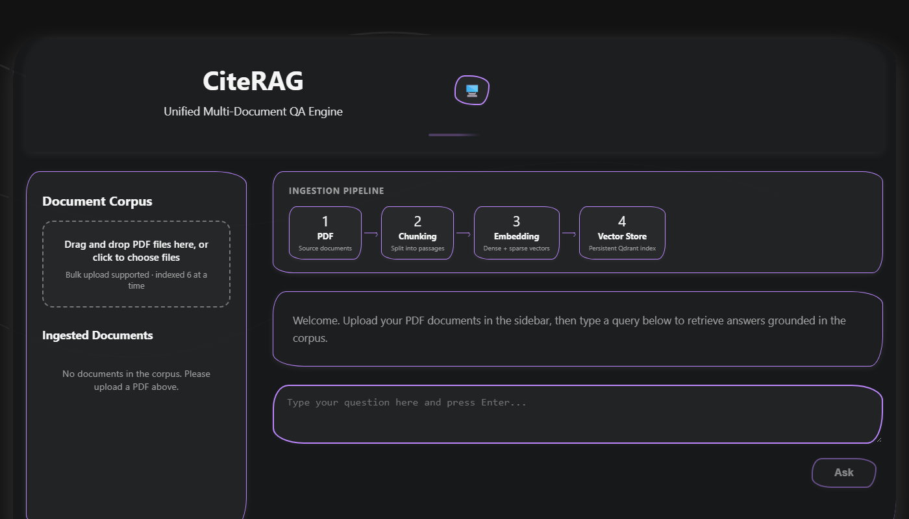

# CiteRAG

[](https://opensource.org/licenses/MIT)
[](https://www.python.org/downloads/)
[](https://fastapi.tiangolo.com/)
[](https://react.dev/)
[](https://www.docker.com/)

A working Retrieval-Augmented Generation application for question answering over PDF documents. The answer prompt is constrained to retrieved passages, and responses include page-level source citations.



**[Documentation](docs/) • [API Reference](docs/API.md) • [Deployment Guide](docs/DEPLOYMENT.md) • [Architecture](docs/ARCHITECTURE.md)**

## Overview

CiteRAG ingests PDF documents into a persistent vector store, then serves natural-language queries through hybrid dense + sparse retrieval followed by answer generation. The API returns the retrieved chunks and structured source citations so answers can be checked against the original pages.

Embedding, retrieval, and the default embedded vector store run locally on CPU. Answer generation currently uses the Google Gemini provider and therefore requires a Google API key.

## Architecture

```
Frontend (React / Vite)
    │
    ▼
Backend (FastAPI)
    ├── Embedding       BAAI/bge-m3 — dense + sparse vectors in one pass
    ├── Vector store    Qdrant       — HNSW ANN + sparse, server-side RRF
    └── LLM provider    Gemini       — current provider
```

**Ingestion pipeline**

PDF → PyMuPDF text extraction → targeted Tesseract OCR (zero-text pages + embedded images) → cleaning + whitespace normalization + header/footer removal → language detection → deterministic recursive chunking with page metadata → bge-m3 embedding → idempotent upsert to Qdrant

**Query pipeline**

Query → validation → bge-m3 embedding → Qdrant hybrid search (dense prefetch + sparse prefetch, RRF fusion) → optional reranking → answer generation → streamed answer with inline citations

## Tech Stack

| Layer | Technology |
|---|---|
| Backend | Python 3.10, FastAPI |
| Embeddings | [BAAI/bge-m3](https://huggingface.co/BAAI/bge-m3) — dense + sparse embeddings from one model |
| Vector store | [Qdrant](https://qdrant.tech) — HNSW ANN, sparse vectors, server-side RRF |
| PDF extraction | PyMuPDF |
| OCR | Tesseract |
| Tokenizer | tiktoken |
| LLM | Google Gemini — the provider currently registered by the application |
| Frontend | React 19, Vite |
| Deployment | Docker, Docker Compose |

## Features

- Upload PDFs via drag-and-drop or file picker — ingested in real time
- Pre-ingested persistent corpus — place PDFs in `./corpus/` for automatic startup ingestion
- Hybrid dense + sparse retrieval fused via Reciprocal Rank Fusion
- Deterministic recursive chunking with reproducible boundaries and citations
- Targeted OCR — full-page OCR only on zero-text pages; image bounding-box OCR on digital pages
- Passage-constrained answer generation with inline provenance tags
- Inline `[filename, page X]` provenance and structured citations per source
- Multi-turn conversation with bounded history (10 turns / 4000 tokens)
- Dark mode with theme persistence
- Optional reranking with timeout fallback
- Evaluation endpoint for p95 latency and optional labeled retrieval/citation metrics

## Quick Start (Docker)

### Prerequisites

- [Docker](https://www.docker.com/) and [Docker Compose](https://docs.docker.com/compose/install/)
- A Google API key for Gemini (get one at [aistudio.google.com](https://aistudio.google.com/))

### 1. Clone the repository

```bash
git clone https://github.com/melbinjp/citerag.git
cd citerag
```

### 2. Create an environment file

Copy the example and fill in your API key:

```bash
cp .env.example .env
```

Edit `.env` and set `GOOGLE_API_KEY` to your Gemini API key.

### 3. Start with Docker Compose

```bash
docker compose up --build
```

This starts the backend with embedded Qdrant (no separate database container needed). The first startup downloads the BGE-M3 embedding model and caches it for subsequent runs.

| Service | URL |
|---|---|
| Backend API | http://localhost:7860 |
| API docs | http://localhost:7860/docs |

### 4. Start the frontend

In a second terminal:

```bash
cd frontend
npm install
npm run dev
```

Open http://localhost:5173 in your browser.

### 5. Upload PDFs

Use the sidebar in the web interface to drag-and-drop or select PDF files. They are ingested in real time. You can also place PDFs in the `./corpus/` directory for automatic ingestion on backend startup.

## API

| Method | Path | Description |
|---|---|---|
| `POST` | `/upload` | Upload and ingest a PDF document |
| `GET` | `/documents` | List all ingested documents |
| `DELETE` | `/documents/{filename}` | Delete a document |
| `GET` | `/documents/{filename}` | Serve a document file |
| `POST` | `/conversations` | Create a conversation session |
| `POST` | `/conversations/{id}/query` | Submit a query (JSON or SSE stream) |
| `DELETE` | `/conversations/{id}` | Delete conversation history |
| `GET` | `/metrics` | Evaluation metrics |
| `GET` | `/healthz` | Health check |

**Request body** — `POST /conversations/{id}/query`

```json
{ "q": "string", "top_k": 5, "stream": true }
```

**SSE event types** — `token` · `sources` · `chunks` · `end` · `error`

## Configuration

All configuration is via environment variables. See [`.env.example`](.env.example) for the full list.

| Variable | Default | Description |
|---|---|---|
| `GOOGLE_API_KEY` | (required) | Gemini API key |
| `LLM_PROVIDER` | `gemini` | LLM provider to use |
| `QDRANT_COLLECTION` | `corpus` | Qdrant collection name |
| `SKIP_INGESTION` | `false` | Skip corpus ingestion on startup |
| `RERANK_ENABLED` | `false` | Enable optional reranking |
| `CHUNK_MAX_TOKENS` | `800` | Maximum tokens per chunk |
| `DEFAULT_TOP_K` | `5` | Default number of results to retrieve |

For Qdrant Cloud deployment, also set:

| Variable | Description |
|---|---|
| `QDRANT_URL` | Qdrant Cloud cluster URL |
| `QDRANT_API_KEY` | Qdrant Cloud API key |

## Project Structure

```
backend/
├── app.py               FastAPI application
├── config.py            Environment-based configuration
├── data_models.py       Shared dataclasses
├── embedding.py         bge-m3 embedding wrapper
├── vector_store.py      Qdrant adapter (hybrid search, RRF)
├── retrieval.py         Query validation and hybrid search
├── reranker.py          Optional reranking
├── generation.py        Answer generation and citation building
├── conversation.py      Multi-turn session store
├── evaluation.py        Metrics service
├── providers/           LLM provider abstraction
├── ingestion/           Extraction, cleaning, chunking, pipeline
└── tests/               Unit, property-based, and integration tests

frontend/
├── src/App.jsx          Main application — split-pane layout
├── src/components/      CitationList, RetrievedChunks, MarkdownMessage, ThemeSwitcher
├── src/services/api.js  HTTP + SSE client
└── index.html           Entry point
```

## Testing

```bash
cd backend
pip install -r requirements.txt
python -m pytest tests/ -v
```

## Contributing

We welcome contributions! Please see our [Contributing Guide](CONTRIBUTING.md) for details.

## Security

For security concerns, please see our [Security Policy](SECURITY.md).

## Changelog

See [CHANGELOG.md](CHANGELOG.md) for release history and updates.

## License

This project is licensed under the MIT License - see the [LICENSE](LICENSE) file for details.

## Acknowledgments

- [BAAI/bge-m3](https://huggingface.co/BAAI/bge-m3) for multilingual embeddings
- [Qdrant](https://qdrant.tech) for the vector store
- [FastAPI](https://fastapi.tiangolo.com/) for the web framework
- [React](https://react.dev/) for the frontend framework

## Current limitations

- PDF is the only supported upload format.
- The API has no authentication or rate limiting by default.
- The provider registry currently contains Gemini only.
- The evaluation endpoint reports measured data only after enough request or labeled evaluation samples exist; this repository does not publish benchmark results.

For bugs or concrete improvements, use the [issue tracker](https://github.com/melbinjp/citerag/issues).

---

**Author**: [Melbin J Paulose](https://github.com/melbinjp) ([@melbinjp](https://github.com/melbinjp))
